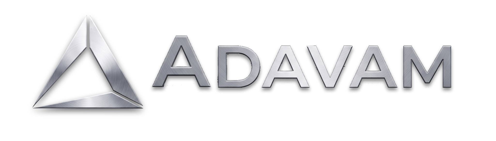
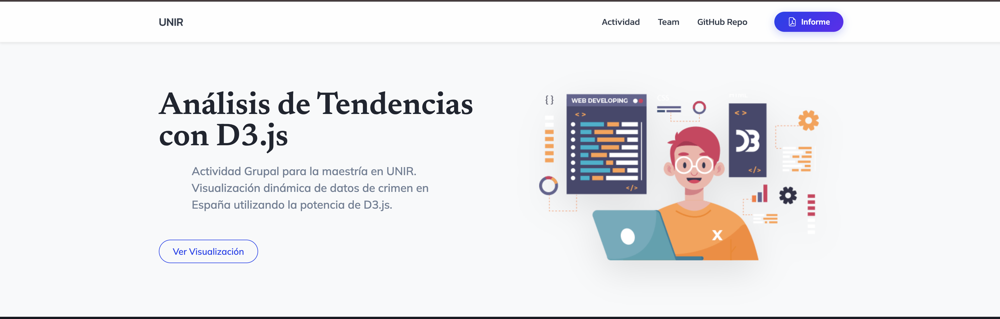

<p align="center">
  
</p>

# Análisis de Tendencias con D3.js



## 📌 Descripción del Proyecto

Este proyecto es una visualización dinámica e interactiva desarrollada como una Actividad Grupal para la maestría en UNIR. Utiliza la potente biblioteca **D3.js** para generar un gráfico de "Bar Chart Race" (carrera de barras) que muestra la evolución de los datos de criminalidad en España desde el año 2019 hasta el 2023.

La interfaz de usuario ha sido cuidadosamente diseñada con un estilo moderno y premium, ofreciendo una experiencia de usuario altamente inmersiva mediante el uso de *Glassmorphism*, gradientes vibrantes y transiciones fluidas.

Desde el punto de vista técnico, el proyecto fue refactorizado y está estructurado utilizando el patrón arquitectónico **Modelo-Vista-Controlador (MVC)** empleando módulos ES6. Esto garantiza un código escalable, modular y fácil de mantener a lo largo del tiempo.

## 🏗️ Estructura del Proyecto

El código está organizado de la siguiente manera:

```text
trend-analysis-with-D3JS/
│
├── index.html               # Punto de entrada de la aplicación, estructura y contenido.
├── datos.csv                # Conjunto de datos base sobre criminalidad.
├── UNIR-Actividad-Grupal-D3JS.pdf # Informe detallado del proyecto.
│
├── css/
│   ├── styles.css           # Framework base (Start Bootstrap).
│   └── custom.css           # Estilos personalizados (Temas, UI Premium, Sombras).
│
├── js/
│   ├── controller.js        # [Controlador] Orquestador de la animación y flujos.
│   ├── model.js             # [Modelo] Lógica de datos, extracción y filtrado de `datos.csv`.
│   ├── view.js              # [Vista] Renderizado del SVG, escalas, ejes y animaciones con D3.js.
│   └── scripts.js           # Interacciones de UI secundarias (ej. scroll de navegación).
│
└── assets/
    └── img/                 # Logos, imágenes del equipo y capturas de pantalla.
```

## 🚀 Instalación y Uso (Servidor Local)

Debido a que el proyecto utiliza el patrón MVC con módulos nativos de JavaScript (`import` / `export`) y realiza la carga de archivos locales (`datos.csv`), los navegadores modernos bloquearán su ejecución si intentas abrir el archivo `index.html` directamente (debido a las políticas de seguridad CORS).

Para visualizar el proyecto correctamente, debes levantar el servidor de desarrollo:

1. Clona el repositorio o abre tu terminal en la carpeta principal del proyecto.
2. Ejecuta el entorno de desarrollo con el siguiente comando:

   ```bash
   npm run dev
   ```
3. Abre tu navegador en la URL que indique la consola (usualmente `http://localhost:3000` o similar).

## 👥 Equipo de Trabajo

- **Daniel Valencia** - Desarrollador Full Stack y Analista de Datos Masivos
- **Francis Proaño** - Analista
- **Leonardo Arauz** - Datos
- **Su Lin Chang** - Diseño
